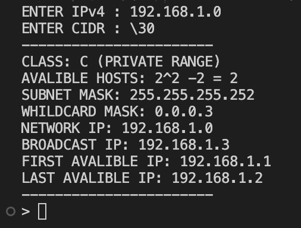
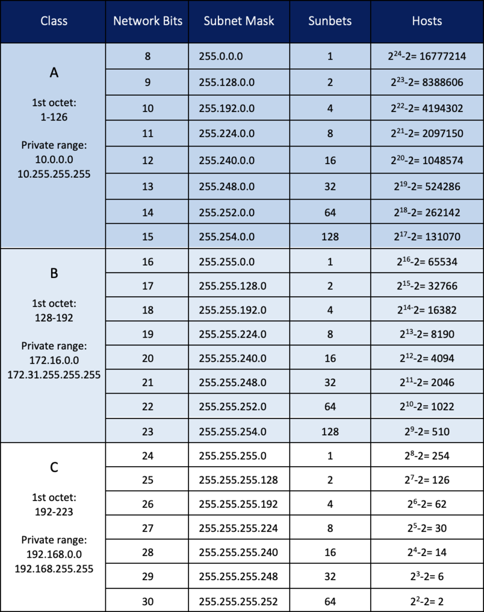

<h1 id="ipv4-subnet-calculator">IPv4 Subnet Calculator</h1>

This calculator returns a variety of information regarding Internet Protocol version 4 (IPv4) subnets including possible network addresses, usable host ranges, subnet mask, and IP class, among others.

<h2 id="screen-shot">Screen Shot</h2>

<h2 id="description">Description</h2>

The act of dividing a network into at least two separate networks is called subnetting, and routers are devices that allow traffic exchange between subnetworks, serving as a physical boundary. IPv4 is the most common network addressing architecture used, though the use of IPv6 has been growing since 2006.

<h2 id="below-is-a-table-providing-typical-subnets-for-ipv4-">Below is a table providing typical subnets for IPv4:</h2>

