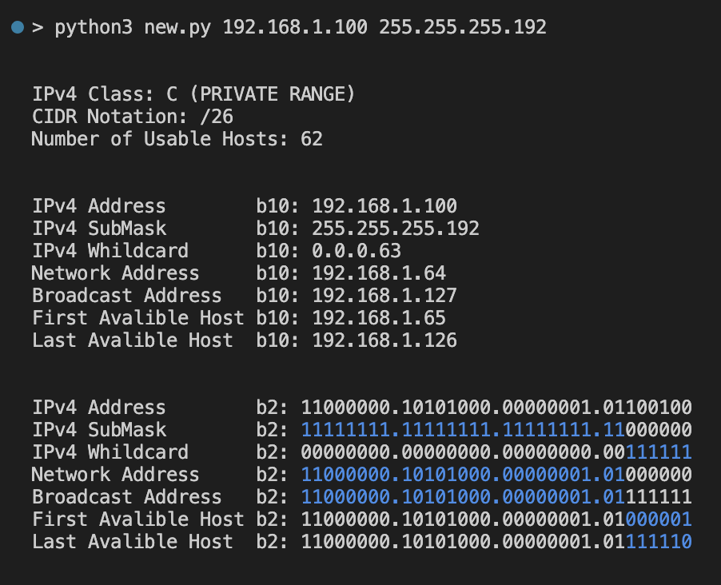

# IPv4 Subnet Calculator
I've used [this](#https://www.calculator.net/ip-subnet-calculator.html) a lot for Subnetting IP addresses, so I decided to make something similar. This calculator returns a variety of information regarding Internet Protocol version 4 (IPv4) subnets including possible network addresses, usable host ranges, subnet mask, and IP class, among others.

## Sample

## Description
The act of dividing a network into at least two separate networks is called subnetting, and routers are devices that allow traffic exchange between subnetworks, serving as a physical boundary. IPv4 is the most common network addressing architecture used, though the use of IPv6 has been growing since 2006.

### Below is a table providing typical subnets for IPv4:

